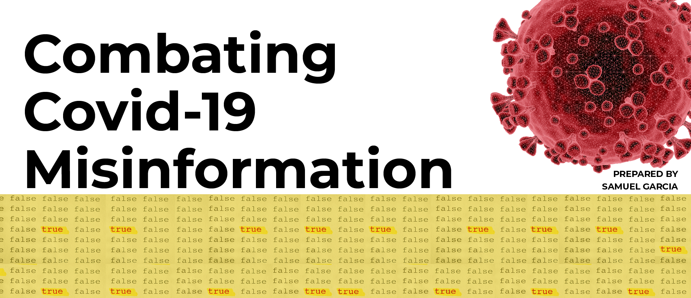

## Hello and WELCOME!

### About me:

- 💻 I’m currently working on KineMa & SineMa. It is a reimagining of Film Recommender Systems.
- 🔍 I’m currently learning Computer Vision, Memory Based Filtering, Matrix Factorization Methods & Latent Features, and Funk Singular Value Decomposition (FunkSVD)!
- 👯 I’m looking to collaborate on Film Recommendation Systems.
- 🤔 I’m looking for help with Computer Vision and Time Series.
- 💬 Ask me about Filmmaking 🎬 
- 📫 How to reach me: You can reach me on [LinkedIn](https://www.linkedin.com/in/samuelgarcia3/)
- ⚡ Fun fact: My cat 🐈 was featured in a commercial with Samuel L. Jackson!

<h1> Check out what I'm currently working on!</h1>

<h1> A Truth Engine System (TES) that employs Natural Language Processing (NLP) to assist individuals in determing wether an article, tweeet, and post is fact or fiction!</h1>

<h1> A film recommendation system that utilizes below-the-line talent to create a more curated movie-going experience! </h1>

